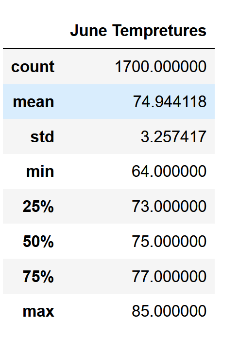
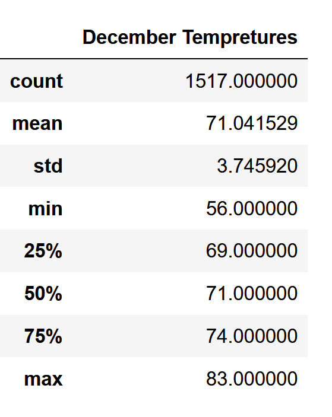
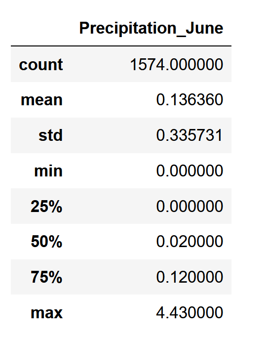
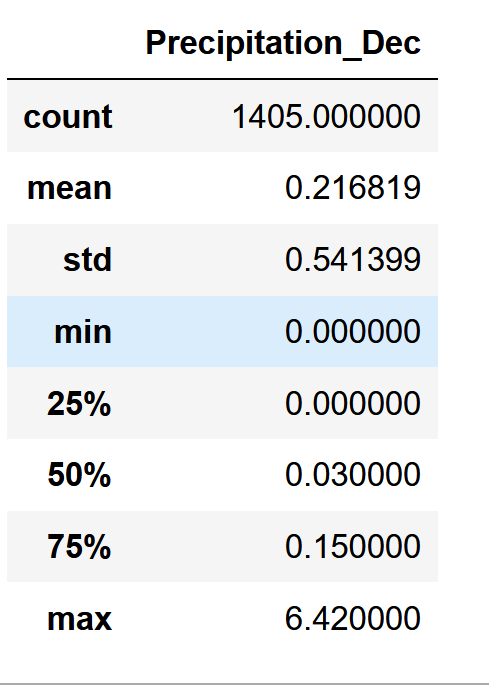

# Surfs_up

##  Overview of the statistical analysis:
Analyzing temperature data for the months of June and December in Oahu, in order to determine if the surf and ice cream shop business is sustainable year-round
Using Python 3.9.13, JupyterLab 3.4.3, VS Code 1.68

## Results:
The data about the weather that was received during the analysys.

### Main Points
1.While June has the higher max temperature (85) it's only 2 degree higher that December (83)
2. The mean temperatures are also very close June (74.9) and December (71)
3. December has the lowest temperature (56) and it can be chilly during some days.

## Summary
As a result the temperatures during June and December are suitable for surfing and ice cream demands. While the lowest December temperature (56) is somewhat low the average (71) and max (83) will be keeping demand high.
Addition data (Precipitation) was analyzed:

While it can be seen that precipitation in December is higher than in June (0,21 vs 0,13) it's still low and supports our first conclusion that the business will be profitable all year round.
